<!---
available via: 
<a href="http://bioconductor.org/"></a>)  
-->

# GenVisR

Intuitively visualizing and interpreting data from high-throughput genomic technologies continues to be challenging. "Genomic Visualizations in R" (GenVisR) attempts to alleviate this burden by providing highly customizable publication-quality graphics focused primarily on a cohort level (i.e., multiple samples/patients). GenVisR attempts to maintain a high degree of flexibility while leveraging the abilities of ggplot2 and bioconductor to achieve this goal.

##Table of Contents
1. [Installation Instructions](#install)
   * [Install from Bioconductor](#install-bioc)
   * [Install from GitHub](#install-github)
2. [Functions](#functions)
   * [waterfall](#waterfall)
   * [lolliplot](#lolliplot)
   * [genCov](#gencov)
   * [TvTi](#tvti)
   * [cnSpec](#cnspec)
   * [cnView](#cnview)
   * [covBars](#covbars)
   * [cnFreq](#cnfreq)
   * [ideoView](#ideoview)
   * [lohView](#lohview)
   * [compIdent](#compident)
   * [geneViz](#geneviz)
3. [Hints](#hints)
4. [Session Info](#session-info)

##<a name="install"></a>Installation Instructions 
GenVisr is an R package available via Bioconductor (version 3.3) and via GitHub. GenVisR currently resides on the devel branch of Bioconductor and will be added to the release branch at the next the next Bioconductor release cycle (spring 2016). To install GenVisR from the Bioconductor devel branch it is neccessary to install the R and bioconductor devel versions. Briefly the steps are as follows:

####<a name="install-bioc"></a>Install from Bioconductor 
note: Requires R version 3.3.0 (devel)

* Full instructions can be found here: http://bioconductor.org/packages/devel/bioc/html/GenVisR.html

1) Install R-devel (version 3.3.0)

* Follow the installation guide here: http://bioconductor.org/developers/how-to/useDevel/

2) Install the latest BiocInstaller

```R
# Repeat the command below until there is no "BiocInstaller"
remove.packages("BiocInstaller")
​
# Install the current version
source("https://bioconductor.org/biocLite.R")
BiocInstaller::biocValid()
```

3) Install GenVisR

```R
source("https://bioconductor.org/biocLite.R")
biocLite("GenVisR")
```

4) Load genVisR package
```R
library(GenVisR)
```

####<a name="install-github"></a>Install from GitHub 
note: Requries R version 3.2.2
* Full instructions can be found here: https://GitHub.com/griffithlab/GenVisR

1) Install the devtools package from CRAN
```R
install.packages("devtools")
```
2) Install Bioconductor dependencies
```R
source("http://bioconductor.org/biocLite.R")
biocLite(c("AnnotationDbi", "biomaRt", "Biostrings", "GenomicFeatures", "GenomicRanges", "Rsamtools"))
```
3) Install GenVisR
```R
devtools::install_github("griffithlab/GenVisR")
```

4) Load genVisR package
```R
library(GenVisR)
```

## <a name="functions"></a>Functions 

### <a name="waterfall"></a>waterfall (mutation overview graphic) 
`waterfall` provides a method of visualizing the mutational landscape of a cohort. The input to `waterfall` consists of a data frame derived from either a .maf (version 2.4) file or a file in MGI annotation format (obtained from The [Genome Modeling System](https://GitHub.com/genome/gms)) specified via the `fileType` parameter. `waterfall` will display the mutation occurrence and type in the main panel while showing the mutation burden and the percentage of samples with a mutation in the top and side sub-plots. Conflicts arising from multiple mutations in the same gene/sample cell are resolved by a hierarchical removal of mutations keeping the most deleterious as defined by the order of the "mutation type" legend. Briefly this hierarchy is as follows with the most deleterious defined first:

|MAF                    |MGI                         |
|:----------------------|:---------------------------|
|Nonsense_Mutation      |nonsense                    |
|Frame_Shift_Ins        |frame_shift_del             |
|Frame_Shift_Del        |frame_shift_ins             |
|Translation_Start_Site |splice_site_del             |
|Splice_Site            |splice_site_ins             |
|Nonstop_Mutation       |splice_site                 |
|In_Frame_Ins           |nonstop                     |
|In_Frame_Del           |in_frame_del                |
|Missense_Mutation      |in_frame_ins                |
|5'Flank                |missense                    |
|3'Flank                |splice_region_del           |
|5'UTR                  |splice_region_ins           |
|3'UTR                  |splice_region               |
|RNA                    |5_prime_flanking_region     |
|Intron                 |3_prime_flanking_region     |
|IGR                    |3_prime_untranslated_region |
|Silent                 |5_prime_untranslated_region |
|Targeted_Region        |rna                         |
|                       |intronic                    |
|                       |silent                      |

Occasionally a situation may arise in which it may be desireable to run `waterfall` on an unsupported file type. This can be achieved by setting the `fileType` parameter to "Custom". Further the hieararchy of mutations (described above) must be specified with the `variant_class_order` parameter which expects a character vector describing the mutations observed in order of most to least important. Note that all mutations in the input data must be specified in the `variant_class_order` parameter. Using this option will require the data frame to contain the following column names: "sample", "gene", "variant_class".

To view the general behavior of `waterfall` we use the `brcaMAF` data structure available within GenVisR. This data structure is a truncated MAF file consisting of 50 samples from the TCGA project corresponding to [Breast invasive carcinoma](https://wiki.nci.nih.gov/display/TCGA/TCGA+MAF+Files#TCGAMAFFiles-BRCA:Breastinvasivecarcinoma) [(complete data from TCGA public web portal)](https://tcga-data.nci.nih.gov/tcgafiles/ftp_auth/distro_ftpusers/anonymous/tumor/brca/gsc/genome.wustl.edu/illuminaga_dnaseq/mutations/genome.wustl.edu_BRCA.IlluminaGA_DNASeq.Level_2.5.3.0/genome.wustl.edu_BRCA.IlluminaGA_DNASeq.Level_2.5.3.0.somatic.maf).


```r
# Load GenVisR library
library(GenVisR)
# Plot the mutation landscape
waterfall(brcaMAF, fileType="MAF")
```

This type of view is of limited use without expanding the graphic device given the large number of genes. Often it is beneficial to reduce the number of cells in the plot by limiting the number of genes plotted. There are three ways to accomplish this, the `mainRecurCutoff` parameter accepts a numeric value between 0 and 1 and will remove genes from the data which do not have at least x proportion of samples mutated. For example if it were desireable to plot those genes with mutations in >= 6% of samples:


```r
# Set seed
set.seed(383)

# Plot only genes with mutations in 6% or more of samples
waterfall(brcaMAF, mainRecurCutoff=.06)
```

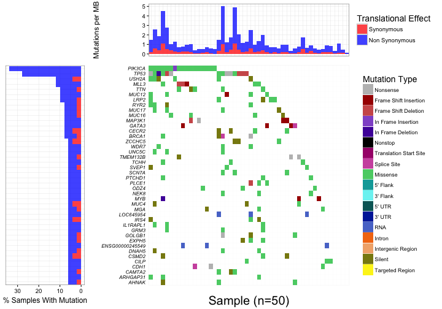

Alternatively one can set a maximum number of genes to plot via the `maxGenes` parameter which will select the top x recurrently mutated genes. In addition specific genes of interest can be displayed using the `plotGenes` parameter. This parameter accepts a case insensitive character vector of genes present in the data and will subset the data on those genes. For example, if it was desirable to plot only the following genes "PIK3CA", "TP53", "USH2A", "MLL3", AND "BRCA1":


```r
# Plot only the specified genes
waterfall(brcaMAF, plotGenes=c("PIK3CA", "TP53", "USH2A", "MLL3", "BRCA1"))
```

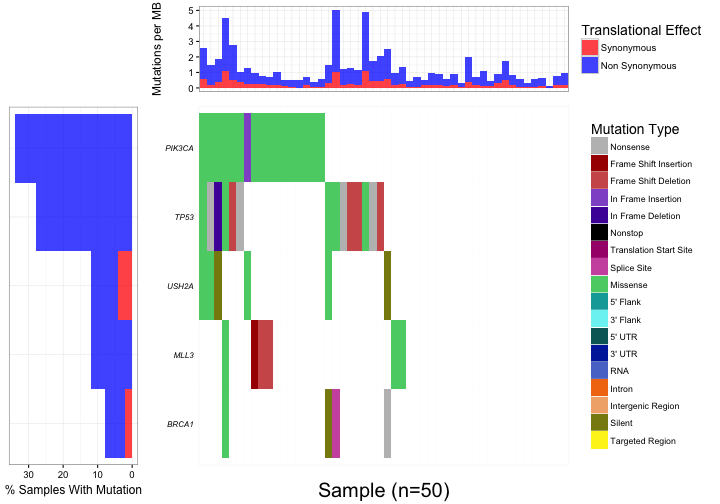

It is important to note that the mutation burden sub plot does not change during these subsets, this is calculated directly from the input via the formula: $mutations\ in\ sample/coverage\ space * 1000000$. The coverage space defaults to the size in base pairs of the "SeqCap EZ Human Exome Library v2.0". This default can be changed via the parameter `coverageSpace`. This calculation is only meant to be a rough estimate as actual coverage space can vary from sample to sample, for a more accurate calculation the user has the option to supply an optional argument via the parameter `mutBurden` supplying the users own calculation of mutation burden for each sample. This should be a data frame with column names 'sample', 'mut_burden' taking the following form:


|sample                       |mut_burden       |
|:----------------------------|:----------------|
|TCGA-A1-A0SO-01A-22D-A099-09 |1.5572403530013  |
|TCGA-A2-A0EU-01A-22W-A071-09 |2.19577768355127 |
|TCGA-A2-A0ER-01A-21W-A050-09 |1.89335842847617 |
|TCGA-A2-A0EN-01A-13D-A099-09 |2.67976843443599 |
|TCGA-A1-A0SI-01A-11D-A142-09 |1.64223789887094 |
|TCGA-A2-A0D0-01A-11W-A019-09 |2.9426074728573  |
|TCGA-A2-A0D0-01A-11W-A019-09 |1.49832578136762 |
|TCGA-A1-A0SI-01A-11D-A142-09 |1.55903682620951 |
|TCGA-A2-A0CT-01A-31W-A071-09 |2.61283158874499 |
|TCGA-A2-A04U-01A-11D-A10Y-09 |1.49772855192887 |

In addition to specifying the mutation burden the user also has the ability to plot additional clinical data. The clinical data supplied should be a data frame in "long" format with column names "sample", "variable", "value". It is recommended to use the `melt` function in the package [reshape2](http://cran.r-project.org/web/packages/reshape2/index.html) to coerce data into this format. Here we add clinical data to be plotted and specify a custom order and colours for these variables putting these values in two columns within the clinical plot legend:


```r
# Create clinical data
subtype <- c('lumA', 'lumB', 'her2', 'basal', 'normal')
subtype <- sample(subtype, 50, replace=TRUE)
age <- c('20-30', '31-50', '51-60', '61+')
age <- sample(age, 50, replace=TRUE)
sample <- as.character(unique(brcaMAF$Tumor_Sample_Barcode))
clinical <- as.data.frame(cbind(sample, subtype, age))

# Melt the clinical data into "long" format.
library(reshape2)
clinical <- melt(clinical, id.vars=c('sample'))

# Run waterfall
waterfall(brcaMAF, clinDat=clinical,
          clinVarCol=c('lumA'='blue4', 'lumB'='deepskyblue', 
                            'her2'='hotpink2', 'basal'='firebrick2',
                            'normal'='green4', '20-30'='#ddd1e7',
                            '31-50'='#bba3d0', '51-60'='#9975b9',
                            '61+'='#7647a2'), 
          plotGenes=c("PIK3CA", "TP53", "USH2A", "MLL3", "BRCA1"),
          clinLegCol=2,
          clinVarOrder=c('lumA', 'lumB', 'her2', 'basal', 'normal',
                         '20-30', '31-50', '51-60', '61+'))
```

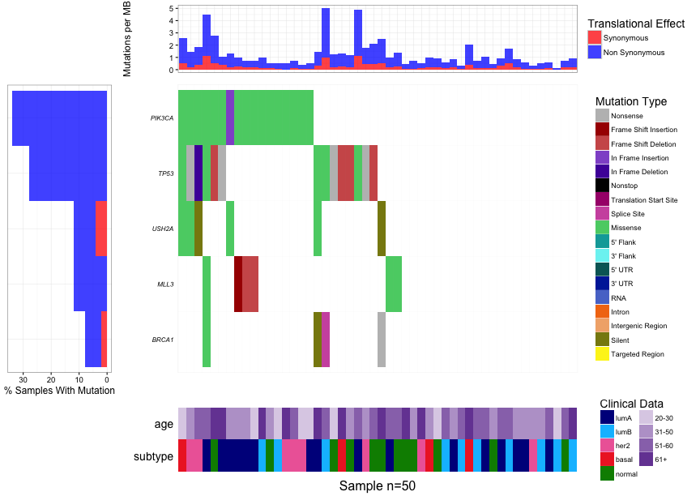

Occasionally there may be samples not represented within the .maf file (due to a lack of mutations). It may still be desirable to plot these samples. To accomplish this simply add the relevant samples into the appropriate column before loading the data and leave the rest of the columns as NA. Alternatively the user can specify a list of samples to plot via the `plotSamples` parameter which will accept samples not in the input data.

### <a name="lolliplot"></a>lolliplot (mutation hotspot graphic) 

`lolliplot` provides a method for visualizing mutation hotspots overlayed on a protein framework. The (basic) input consists of a data frame with required columns "transcript_name", "gene" and "amino_acid_change" giving the ensembl transcript id, gene name, and the amino acid change in p. notation respectively. The data frame input to `lolliplot` must contain only one unique transcript name. `lolliplot` uses the R package [biomaRt](https://bioconductor.org/packages/release/bioc/html/biomaRt.html) to obtain sequence and protein domain information and as such needs an active internet connection. `lolliplot` assumes the species from which to build a mart is *hsapiens*, this assumption can be changed via the parameter `species` which which will expect a valid ensembl mart species. Further by default the latest ensembl annotations will be used to build the protein framework. If it is desireable to build the protein framework from an older ensembl annotation the user has the option to change the annotation version by changing the `host` parameter. For example if the user wanted to use the Dec. 2013 ensembl annotation they would specify host="dec2013.archive.ensembl.org", the host parameter in lolliplot will pass it's value to biomaRt::useMart, see biomaRt doc for using older archived annotations via biomaRt.

It should be noted that to ensure the most accurate graphic representation the ensembl annotation version for the "amino_acid_change" column supplied by the user and that which is used for the biomaRt queries should be identical.


```r
# Create input data
data <- brcaMAF[brcaMAF$Hugo_Symbol == 'TP53',c('Hugo_Symbol', 'amino_acid_change_WU')]
data <- as.data.frame(cbind(data, 'ENST00000269305'))
colnames(data) <- c('gene', 'amino_acid_change', 'transcript_name')

# Call lolliplot
lolliplot(data)
```

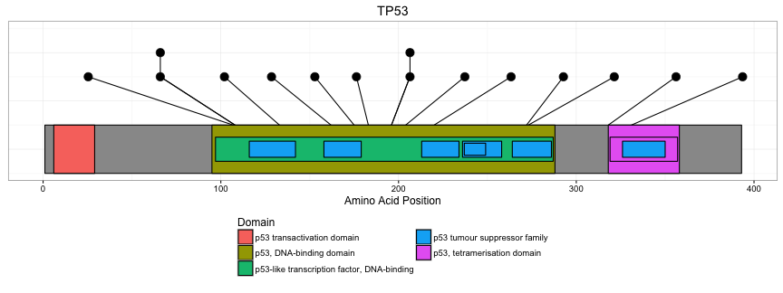

In an effort to maintain a high degree of flexibility the user has the option of selecting columns on which to fill and label. The parameters `fillCol` and `labelCol` allow this behavior by taking column names on which to fill and label respectively. Additionally one can plot the amino acid sidechain information in lieu of protein domains.


```r
# Add additional columns to the data
data$gender <- sample(c("Male", "Female"), 15, replace=TRUE)
data$impact <- sample(c("Low", "Medium", "High"), 15, replace=TRUE)

# Call lolliplot
lolliplot(data, fillCol='gender', labelCol='impact', sideChain=TRUE)
```

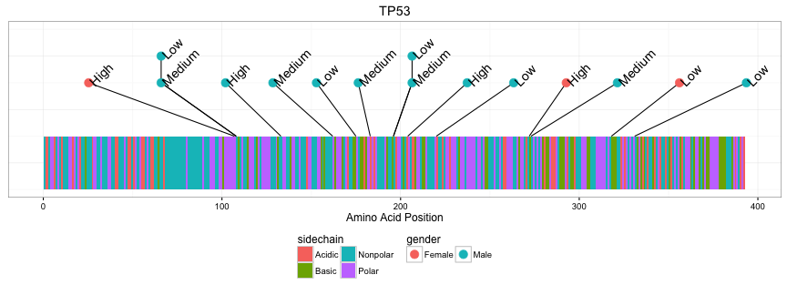

The user has the option of plotting an additional track in the area underneath the protein track via the parameter `y`. Input for this additional layer consists of a data frame with column names "transcript_name" and "amino_acid_change" in p. notation. If input to parameter `y` is supplied to `lolliplot` and the `fillCol` and/or `labelCol` parameters are specified (see above) lolliplot will look for the columns in both data frames supplied to `x` and `y` and act accordingly. Note that input to parameter `y` must be from the same transcript as specified in the data frame supplied to parameter `x`.


```r
# Create additional data
data2 <- data.frame("transcript_name"="ENST00000269305",
                    "amino_acid_change"="p.Q331*")

# Call lolliplot
lolliplot(data, y=data2, fillCol='impact', labelCol='amino_acid_change')
```

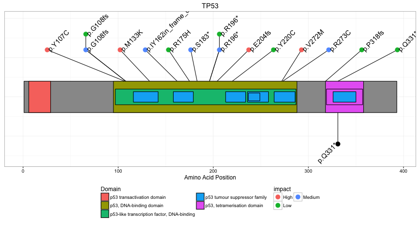

`lolliplot` uses a force field model from the package [FField](http://cran.r-project.org/web/packages/FField/index.html) to repulse and attract data in an attempt to achieve a reasonable degree of separation between points. Suitable defaults have been set for the majority of use cases. On occasion the user may need to manually adjust the force field parameters especially if the number of points to apply the model to is large. This can be done for both upper and lower tracks individually via `rep.fact`, `rep.dist.lmt`, `attr.fact`, `adj.max`, `adj.lmt`, `iter.max` please see documentation for [FField::FFieldPtRep](http://cran.r-project.org/web/packages/FField/FField.pdf) for a complete description of these parameters.

### <a name="gencov"></a>genCov (sequence coverage graphic)

`genCov` provides a methodology for viewing coverage information in relation to a gene track. It takes a named list of data frames with each data frame containing column names "end" and "cov" and rows corresponding to coordinates within the region of interest. Additional required arguments are a GRanges object specifying the region of interest, a BSgenome for gc content calculation, and a TxDb object containing transcription metadata (see the package [Granges](http://www.bioconductor.org/packages/release/bioc/html/GenomicRanges.html) for more information). `genCov` will plot a genomic features track and align coverage data in the list to the plot. It is recommended to use [bedtools multicov](http://bedtools.readthedocs.org/en/latest/content/tools/multicov.html) to obtain coverage information for a region of interest. We demonstrate `genCov` functionality using pseudo-data containing coverage information for the gene PTEN.


```r
# Load transcript meta data
library(TxDb.Hsapiens.UCSC.hg19.knownGene)
txdb <- TxDb.Hsapiens.UCSC.hg19.knownGene

# Load BSgenome
library(BSgenome.Hsapiens.UCSC.hg19)
genome <- BSgenome.Hsapiens.UCSC.hg19

# Define a region of interest 
gr <- GRanges(seqnames=c("chr10"), ranges=IRanges(start=c(89622195), 
end=c(89729532)), strand=strand(c("+")))

# Create Data for input
start <- c(89622194:89729524)
end <- c(89622195:89729525)
chr <- 10
cov <- c(rnorm(100000, mean=40), rnorm(7331, mean=10))
cov_input_A <- as.data.frame(cbind(chr, start, end, cov))

start <- c(89622194:89729524)
end <- c(89622195:89729525)
chr <- 10
cov <- c(rnorm(50000, mean=40), rnorm(7331, mean=10), rnorm(50000, mean=40))
cov_input_B <- as.data.frame(cbind(chr, start, end, cov))

# Define the data as a list
data <- list("Sample A"=cov_input_A, "Sample B"=cov_input_B)

# Call genCov
genCov(data, txdb, gr, genome, gene_labelTranscriptSize=2, transform=NULL, base=NULL)
```

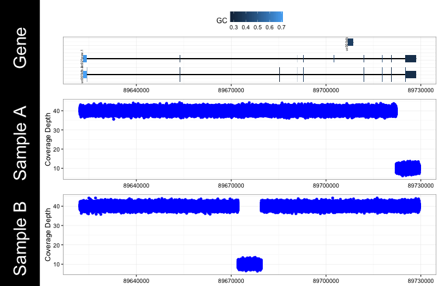


Often it may be usefull to compress genomic space, genCov will perform such a compression via a log transform for each feature type,'Intron','CDS','UTR' specified by the parameter `transform`. The degree of compression can be set via the parameter `base` which will perform the appropriate log compression for the features specified in `transform`. This behavior will occur by default, to turn off compression set the `transform` and `base` parameters to NULL. Here we display `genCov` compression functionality with log-10 compression for intronic space, and log-2 compression for CDS and UTR regions. Further we choose to display a simplified representation of genomic features within the region of interest via the `reduce` parameter which will merge all genomic features within a region of interest into a single transcript.


```r
# Turn off feature compression and reduce gene transcripts
genCov(data, txdb, gr, genome, transform=c("Intron", "CDS", "UTR"), base=c(10, 2, 2), reduce=TRUE)
```


### <a name="tvti"></a>TvTi (transition/transversion graphic)
`TvTi` provides a framework for visualizing transversions and transitions for a given cohort. Input consists of a .maf (version 2.4) file containing sample and allele information (see .maf spec). Alternatively the `fileType` parameter can be set to "MGI" with the input supplied consisting of a data frame with column names "sample", "reference", and "variant". Files for the "MGI" format can be obtained via the [Genome Modeling System](https://GitHub.com/genome/gms). TvTi will remove indels and multinucleotide calls from the input and plot the proportion of Transition/Transversion types for each sample specified in the input file.


```r
# Call TvTi
TvTi(brcaMAF, lab_txtAngle=75, fileType="MAF")
```

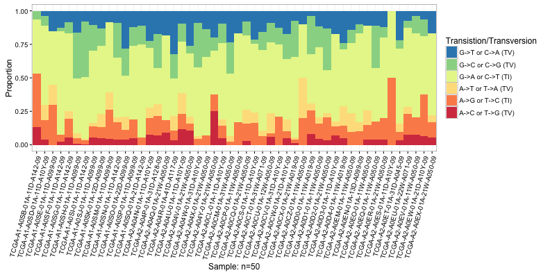

`TvTi` will also plot the observed frequency of each Transition/Transversion type in lieu of proportion if the `type` parameter is set to "Frequency". Here we plot the observed frequency from `brcaMAF` and change the default colors of the plot. When modifying the color palette via the `palette` parameter specify a character vector of length 6 containing a new color for each Transition/Transversion type.


```r
# Plot the frequency with a different color pallete
TvTi(brcaMAF, type='Frequency', 
palette=c("#77C55D", "#A461B4", "#C1524B", "#93B5BB", "#4F433F", "#BFA753"), 
lab_txtAngle=75, fileType="MAF")
```

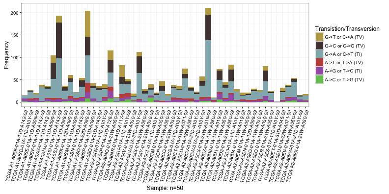

If there are prior expectations about the transition/transversion rate the user can specify that information via the parameter `y` which takes a named vector with names corresponding to each transition/transversion type. The vector must be of length 6 with names "A->C or T->G (TV)", "A->G or T->C (TI)", "A->T or T->A (TV)", "G->A or C->T (TI)", "G->C or C->G (TV)", and "G->T or C->A (TV)". The Resulting plot will contain an additional subplot corresponding to the apriori expectations.


```r
# Create a named vector of apriori expectations
expec <- c("A->C or T->G (TV)"=.066, "A->G or T->C (TI)"=.217,
           "A->T or T->A (TV)"=.065, "G->A or C->T (TI)"=.4945,
           "G->C or C->G (TV)"=.0645, "G->T or C->A (TV)"=.093)

# Call TvTi with the additional data
TvTi(brcaMAF, y=expec, lab_txtAngle=45, fileType="MAF")
```

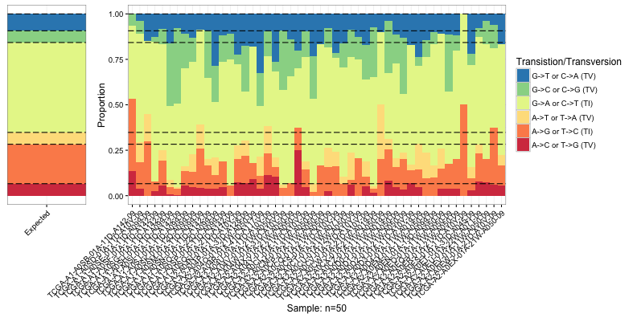

### <a name="cnspec"></a>cnSpec (copy altered cohort graphic)

cnSpec produces a plot displaying copy number segments at a cohort level. Basic input consists of a data frame with column names 'chromosome', 'start', 'end' 'segmean' and 'sample' with rows denoting segments with copy number alterations. A UCSC genome is also required (defaults to 'hg19') to determine chromosomal boundaries. cnSpec will produce a grid faceted on chromosome and sample displaying all CN segment calls in the input. Here we use the attached data set LucCNseg containing copy number segment calls for 4 samples from whole genome sequencing data.


```r
# Call cnSpec with minimum required inputs
cnSpec(LucCNseg, genome="hg19")
```

```
## genome specified is preloaded, retrieving data...
```

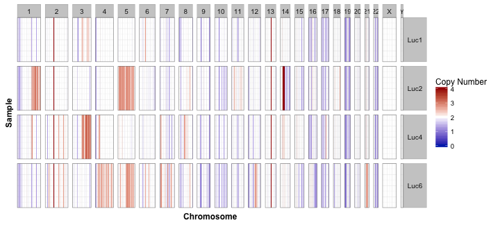

By default a few select genomes are included as part of GenVisR, these are "hg38", "hg19", "mm10", "mm9", "rn5". If input into `genome` is not one of the previously mentioned genomes cnSpec will attempt to query the UCSC sql database to obtain chromosomal boundary information. This has been built in as a convenience, if internet connectivity is an issue, or if copy number segment calls are derived from an assembly not supported by UCSC the user can specify chromosomal boundaries via the argument `y`. This should take the form of a data frame with column names "chromosome", "start", "end" with rows providing positions for each chromosome. An example of this is provided in the included data set hg19chr.


```r
# Call cnSpec with the y parameter
cnSpec(LucCNseg, y=hg19chr)
```

### <a name="cnview"></a>cnView (copy altered single sample graphic)
cnView provides a method for visualizing raw copy number calls focused on either a single chromosome or all chromosomes. Unlike the majority of plots within GenVisR cnView is intended to be used for a single sample. Input consists of a data frame with column names "chromosome", "coordinate", "cn", and "p_value" (optional) as well as a specification of which chromosome to plot specified via the parameter `chr` and which genome assembly should be used for chromosome boundaries `genome`. The algorithm will produce an ideogram on the top track and plot copy number calls beneath. If a "p_value" column is present in the input data cnView will create a transparency value for all calls/observations based on that column with less significant calls having a higher transparency. Eliminating the "p_value" column will terminate this behavior. Here we demonstrate `cnView` pseudo-data for chromosome 14.


```r
# Create data
chromosome <- 'chr14'
coordinate <- sort(sample(0:106455000, size=2000, replace=FALSE))
cn <- c(rnorm(300, mean=3, sd=.2), rnorm(700, mean=2, sd=.2), rnorm(1000, mean=3, sd=.2))
data <- as.data.frame(cbind(chromosome, coordinate, cn))

# Call cnView with basic input
cnView(data, chr='chr14', genome='hg19', ideogram_txtSize=4)
```

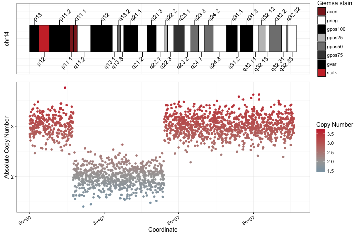

`cnView` obtains ideogram information and chromosomal boundaries either via a preloaded genome or the UCSC sql database if it is available. In the interest of flexibility the user also has the option of specifying cytogenetic information to the argument `y`. This input should take the form of a data frame with column names "chrom", "chromStart", "chromEnd", "name", "gieStain". This format mirrors what is retrievable via the aforementioned MySQL database.

If it is desired, `cnView` has the ability to overlay segment calls on the plot. This is achieved by providing a data frame with column names: "chromosome", "start", "end", and "segmean" to the argument `z`. We demonstrate this functionality via pseudo-data.


```r
# create copy number data
chromosome <- 'chr14'
coordinate <- sort(sample(0:106455000, size=2000, replace=FALSE))
cn <- c(rnorm(300, mean=3, sd=.2), rnorm(700, mean=2, sd=.2), rnorm(1000, mean=3, sd=.2))
data <- as.data.frame(cbind(chromosome, coordinate, cn))

# create segment data
dataSeg <- data.frame(chromosome=c(14, 14, 14), start=coordinate[c(1, 301, 1001)], end=coordinate[c(300, 1000, 2000)], segmean=c(3, 2, 3))
# call cnView with included segment data
cnView(data, z=dataSeg, chr='chr14', genome='hg19', ideogram_txtSize=4)
```

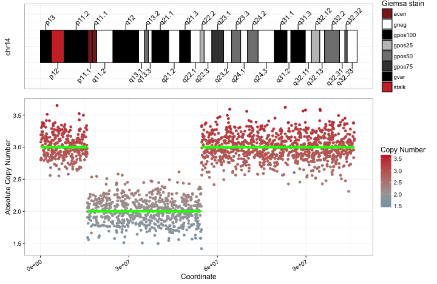

### <a name="covbars"></a>covBars (sequencing coverage cohort)

`covBars` produces a plot displaying sequencing coverage at a cohort level. Basic input consists of a matrix with columns representing samples, rows denoting sequencing depth (i.e. reads of depth), and elements of the matrix representing the number of bases with x depth for x sample.


```r
# Example input to x
x <- matrix(sample(100000,500), nrow=50, ncol=10, 
dimnames=list(0:49,paste0("Sample",1:10)))

covBars(x)
```

```
## Argument supplied to col has 0 length... default colour scheme will be used
```

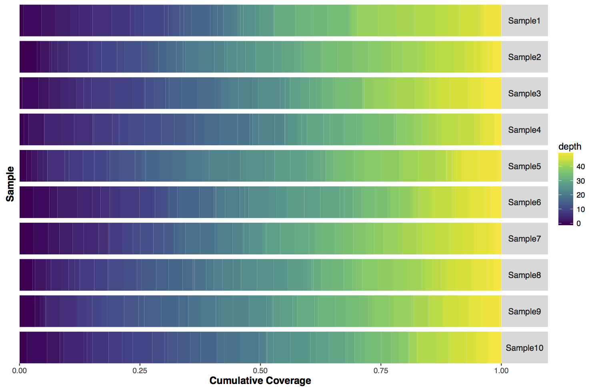

By default the viridis color scheme is used. An alternate vector of colors can be supplied to the param `colour`.

```r
covBars(x, colour=c("blue","grey","red"))
```

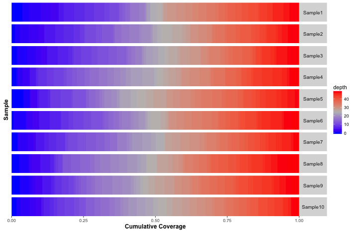

### <a name="cnfreq"></a>cnFreq (proportional copy number alterations)

`cnFreq` produces a plot displaying the proportion (default) or frequency of copy number losses/gains at a cohort level. Basic input consists of a data frame with rows representing the proportion of CN losses/gains across the genome (default), or actual CN values.


```r
# Example input to x
xstart <- seq(0,4990000,length.out=500)
xloss <- rep(runif(10,0,0.6),rep(50,10))/1.5
xloss <- xloss + jitter(xloss,amount=0.002)
x <- data.frame(chromosome=rep(paste0("chr",1:5),rep(500,5)), 
start=xstart, end=xstart+10000, loss=xloss, gain=(1-xloss))

# Plot the data
cnFreq(x)
```

```
## Detected "chr" in the chromosome column of x... proceeding
```

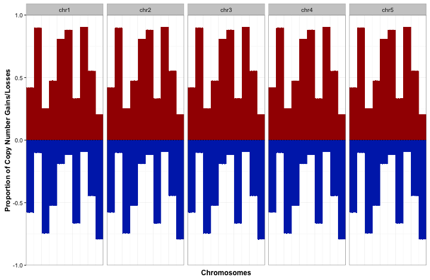

An alternate long data frame format with actual copy number values may be used. The default cutoffs for loss and gain are 1.5 and 2.5 respectively.


```r
cnFreq(LucCNseg)
```

### <a name="ideoview"></a>ideoView (ideogram graphic)
The user has the ability to plot an ideogram representative of the chromosome of interest for a given assembly via the function `ideoView`. Basic input consists of a data frame with column names: "chrom", "chromStart", "chromEnd", "name", "gieStain" mirroring the format retrievable from the UCSC sql database, and a chromosome for which to display `chromsome`. Here we use the preloaded genome hg38 in the attached data set cytoGeno.


```r
# Obtain cytogenetic information for the genome of interest
data <- cytoGeno[cytoGeno$genome == 'hg38',]

# Call ideoView for chromosome 1
ideoView(data, chromosome='chr1', txtSize=4)
```

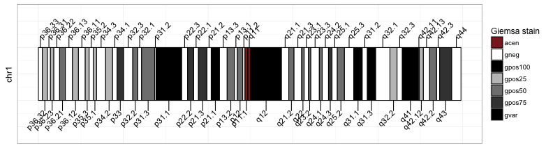

### <a name="lohview"></a>lohView (mean absolute LOH difference)
`lohView` obtains mean absolute LOH differene between tumor VAF and a default normal VAF parameter set at 50 for all calls made within a specified window length. Input data should include column names "chromosome", "position", "n_vaf", "t_vaf", "sample". If the `method` specified is "tile", mean LOH difference will be plotted for adjacent windows across the entire genome for multiple samples. If the`method` specified is "slide", mean LOH difference for overlapping windows will be plotted over a `step` sized window. When `gender` is NULL, LOH calculations will be excluded from both the X and Y chromosome for all samples. When the `gender` of each sample is specified, LOH calculations will include X chromosomes, along with all autosomes for all samples.

```r
# Call lohView with basic input 
lohView(x=HCC1395_Germline)
```

```
## Error in is.data.frame(x): object 'HCC1395_Germline' not found
```

### <a name="compident"></a>compIdent (snp identity graphic)

`compIdent` produces a plot comparing samples based on identity snp variant allele frequency (VAF) values. The graphic displays VAF values at genomic locations given via the parameter `target`. If no argument is supplied to `target` the algorithm will default to 24 biallelic identity snps from the hg19 genome assembly identified by "pengelly et al. Genome Med. 2013, PMID 24070238". `compIdent` expects a data frame with rows specifying samples and columns providing sample names and bam file locations given to parameter `x`. Please note that compIdent will not index bam files and will look for a .bai file for the associated bam.

Here we show the behavior of `compIdent` using a predefined dataset of vaf values accessible via the debut parameter (for debugging and display purposes only). In an ideal case we would expect to see similar vaf values for samples from the same origin at all 24 target sites providing a usefull method for identifying sample mix ups. Occasionally as seen here for the HCC1395 breast cancer cell line copy number alterations can skew the results making a sample seem unrelated.


```r
# Read in BSgenome object (hg19)
library(BSgenome.Hsapiens.UCSC.hg19)
```

```
## Error in library(BSgenome.Hsapiens.UCSC.hg19): there is no package called 'BSgenome.Hsapiens.UCSC.hg19'
```

```r
hg19 <- BSgenome.Hsapiens.UCSC.hg19
```

```
## Error in eval(expr, envir, enclos): object 'BSgenome.Hsapiens.UCSC.hg19' not found
```

```r
# Generate plot
compIdent(genome=hg19, debug=TRUE)
```

```
## Error in compIdent_bamRcnt_qual(genome, target): object 'hg19' not found
```

### <a name="geneviz"></a>geneViz
It is also possible to plot just a gene of interest identified by specifying a Txdb object, GRanges object, and a BSgenome via a call to `geneViz`. The algorithm will plot genomic features for a single gene bounded by the Granges object overlaying gc content calculations over those features obtained from the provided BSgenome. Note that geneViz will output the plot and additional supplemental information used in the plot generation as a list, to call the plot call the first element of the list.


```r
# need transcript data for reference
txdb <- TxDb.Hsapiens.UCSC.hg19.knownGene
```

```
## Error in eval(expr, envir, enclos): object 'TxDb.Hsapiens.UCSC.hg19.knownGene' not found
```

```r
# need a biostrings object for reference
genome <- BSgenome.Hsapiens.UCSC.hg19
```

```
## Error in eval(expr, envir, enclos): object 'BSgenome.Hsapiens.UCSC.hg19' not found
```

```r
# need Granges object 
gr <- GRanges(seqnames=c("chr10"), ranges=IRanges(start=c(89622195), 
end=c(89729532)), strand=strand(c("+")))
```

```
## Error in eval(expr, envir, enclos): could not find function "GRanges"
```

```r
# Plot and call the graphic
p1 <- geneViz(txdb, gr, genome)
```

```
## Error in GenomicFeatures::transcriptsByOverlaps(txdb, gr): object 'txdb' not found
```

```r
p1[[1]]
```

```
## Error in eval(expr, envir, enclos): object 'p1' not found
```

## <a name="hints"></a>Hints

Due to the complex nature and variability of the graphics produced by GenVisR it is recommended that the user adjust the graphics device size for all outputs manually. If not given enough space within the graphics device grob objects will start to collide This can be done via the following:


```r
pdf(file="plot.pdf", height=8, width=14)
# Call a GenVisR function
waterfall(brcaMAF)
dev.off()
```

For the majority of plots there is a layer parameter, this allows the user to specify an additional ggplot2 layer. Using this parameter one could perform a variety of tasks including modifying the theme to control label text size, adding titles to plots, etc. Here we suppress all x-axis labels:


```r
library(ggplot2)
plot_theme <- theme(axis.text.x=element_blank(),
                    axis.title.x=element_blank(),
                    axis.ticks.x=element_blank())

cnFreq(LucCNseg, plotLayer=plot_theme)
```

## <a name="session-info"></a>Session Info


```r
sessionInfo()
```

```
## R Under development (unstable) (2016-01-30 r70052)
## Platform: x86_64-apple-darwin13.4.0 (64-bit)
## Running under: OS X 10.11.3 (El Capitan)
## 
## locale:
## [1] en_US.UTF-8/en_US.UTF-8/en_US.UTF-8/C/en_US.UTF-8/en_US.UTF-8
## 
## attached base packages:
## [1] stats     graphics  grDevices utils     datasets  methods   base     
## 
## other attached packages:
## [1] reshape2_1.4.1  GenVisR_0.99.10 knitr_1.12.3   
## 
## loaded via a namespace (and not attached):
##  [1] Rcpp_0.12.3                 formatR_1.2.1              
##  [3] plyr_1.8.3                  highr_0.5.1                
##  [5] GenomeInfoDb_1.7.6          XVector_0.11.4             
##  [7] GenomicFeatures_1.23.22     bitops_1.0-6               
##  [9] tools_3.3.0                 zlibbioc_1.17.0            
## [11] biomaRt_2.27.2              digest_0.6.9               
## [13] RSQLite_1.0.0               evaluate_0.8               
## [15] gtable_0.1.2                DBI_0.3.1                  
## [17] parallel_3.3.0              gridExtra_2.0.0            
## [19] rtracklayer_1.31.6          stringr_1.0.0              
## [21] Biostrings_2.39.7           S4Vectors_0.9.26           
## [23] gtools_3.5.0                IRanges_2.5.24             
## [25] stats4_3.3.0                grid_3.3.0                 
## [27] FField_0.1.0                Biobase_2.31.3             
## [29] AnnotationDbi_1.33.7        XML_3.98-1.3               
## [31] BiocParallel_1.5.16         ggplot2_2.0.0              
## [33] magrittr_1.5                scales_0.3.0               
## [35] Rsamtools_1.23.3            BiocGenerics_0.17.3        
## [37] GenomicRanges_1.23.13       GenomicAlignments_1.7.13   
## [39] SummarizedExperiment_1.1.18 colorspace_1.2-6           
## [41] labeling_0.3                stringi_1.0-1              
## [43] RCurl_1.95-4.7              munsell_0.4.2
```
